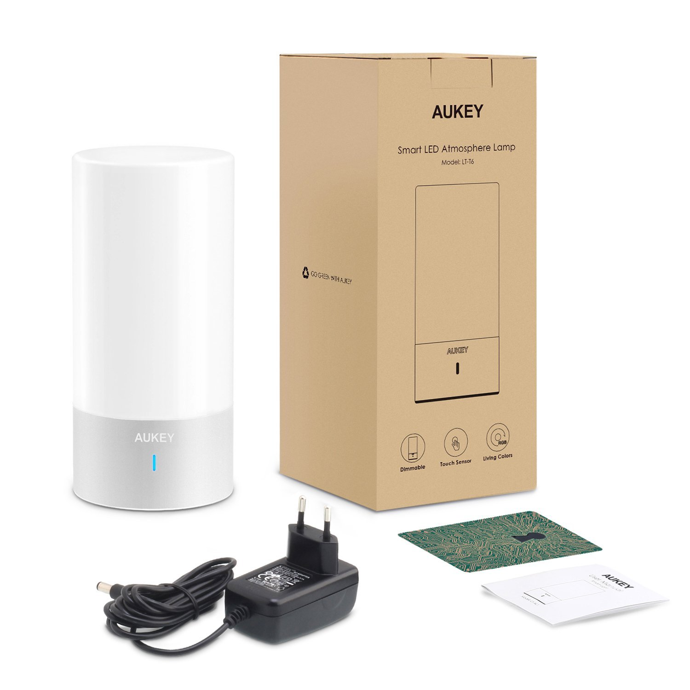
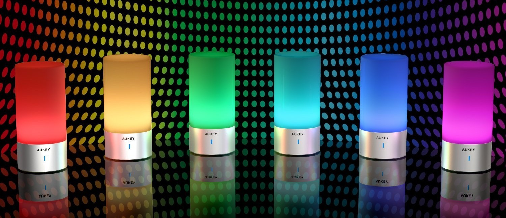
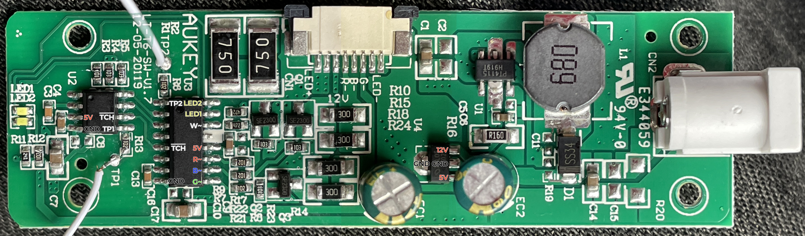
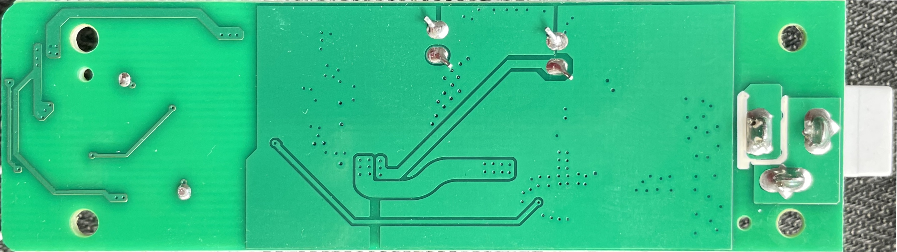
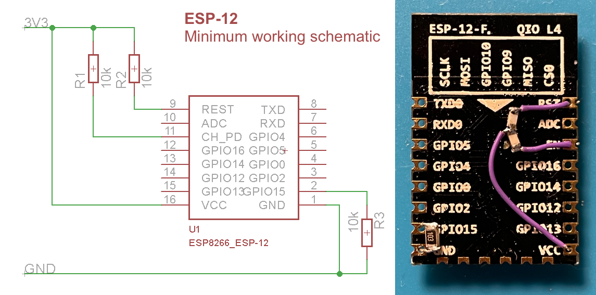
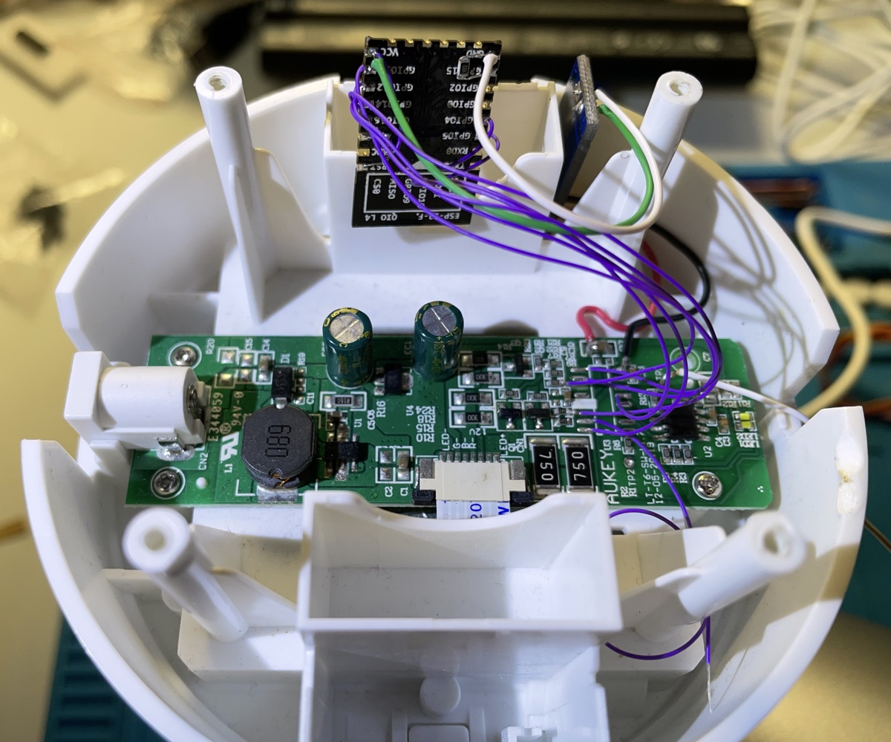

# MyLamp
Open-Source an [AUKEY-LT-T6 RGB desktop lamp](docs/20190521190033-LT-T6_User_Manual.pdf) to make it better!

I always thougt that this lamp is very nice (hardware wise) but lacking many features and with a crippled UX. So I took-on the challenge and here are the results!

A long TODO list yet (mostly software), but -at least- an already usable hardware base to keep going.

This is Open-Source/Creative Commons: **enjoy!!**

## Reverse-Engineering
This is the found-out pinout of the board:

**Two main ICs:**
* Un unknown (sanded) 5V microcontroller
* Un unknown (sanded) 5V touch sensor IC

**Other ICs:**
* 78L05 - Voltage regulator (7-12V -> 5V)
* PT4115 - High power LED dimmer (White LED driver)
* SE2300 - Multi N-Gate MOSSFET (Red, Green & Blue LEDs driver)

## New hardware
I used an ESP-12 (ESP8266 module) to substitute (and upgrade) the original microcontroller functionality:

I will include here a complete Fritzing schematic in the future and some working details.

## User manual
This *new* lamp does several *new* things passing through different stages:

1. **START:** it flashes in **red** when you plug it into an AC outlet, indicating it's starting and entering the BOOT stage.
2. **BOOT:** during boot-up it tries to connect to an **OTA WiFi** (*lampsetup*/*lampsetup*) that will allow you to upgrade the firmware. If it succeeds, the lamp flashes in **orange** and stays in this **OTA update state** until powered-off.
3. **CONNECTION:** if the lamp has already been configured, it will connect to the saved WiFi network and proceed to the FINAL stage. If not, it will enter the SETUP stage.
4. **SETUP:** if it's the **first time** you turn the lamp on (or the saved WiFi connection is not valid/available), it creates an **open WiFi access point** named **WiFiLampSetup** to which you can connect to (with your smartphone, tablet or computer) to setup your WiFi connection. This stage only lasts 120 seconds: if nothing is done or you cancel the configuration, a new **password protected WiFi access point** will be created: **MyLamp**/**12345678**.
5. **FINAL:** once the lamp is done intializing, it will flash in **green** indicating it's ready to be used.

**NORMAL operation** (FINAL stage)
* Touch the base to turn on/off the lamp (to the last configured color).
* Long-touch to turn on the high-power white-only light.
* Go to http://mylamp.local to access the control App (\*).

**(\*)** The lamp must be connected to same network that the device you want to use to access this portal. If the lamp wasn't able to connect to your network, you should connect to the lamp's WiFi network itself (**MyLamp**/**12345678**).

## Code
You can find the ESP-12 (ESP8266 module) code in the [code folder](code/MyLamp/).
This software uses the [WiFiManager libray](https://github.com/tzapu/WiFiManager) to configure the WiFi connection *on-the-fly*.
This software uses the SPIFFs local storage of your ESP-12: use [this plugin](https://github.com/esp8266/arduino-esp8266fs-plugin) to upload the contents.

## LICENSE

This work is licensed under the [GNU General Public License v3.0](LICENSE-GPLV30). All media and data files that are not source code are licensed under the [Creative Commons Attribution 4.0 BY-SA license](LICENSE-CCBYSA40).

More information about licenses in [Opensource licenses](https://opensource.org/licenses/) and [Creative Commons licenses](https://creativecommons.org/licenses/).